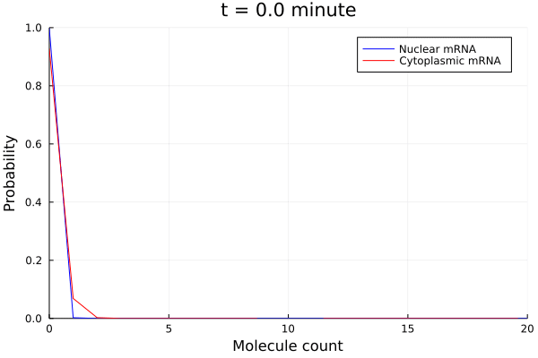

# MAPK-activated transcription in yeast

In this example, we solve a four-state, two-compartment, MAPK-activated gene expression model taken from a published work by Munsky et al.[1].

First, let's import `NumCME` and other useful packages
```julia
using NumCME 
using Catalyst
using StaticArrays: @MVector
using Sundials: CVODE_BDF
```

Now, we will code up the time-varying Hog1p signal. Here, we use the parameters provided by the paper.
```julia
const r1 = 6.1e-3
const r2 = 6.9e-3
const η = 5.9
const Ahog = 9.3e9
const Mhog = 2.2e-2
function Hog1p(t)
    u = (1.0 - exp(-r1 * t)) * exp(-r2 * t)
    signal = Ahog * (u / (1.0 + u / Mhog))^η
    return signal 
end
```

We use `Catalyst.jl`'s beautiful DSL to define the reactions and rates of the model. You can see that the code is almost self-explanatory.

```julia
@parameters k01, k10, a, k12, k21, k23, k32, λ0, λ1, λ2, λ3, ktrans, γnuc, γcyt
rn = @reaction_network begin 
    k01, G0 --> G1
    max(0, k10 - a*Hog1p(t)), G1 --> G0 
    k12, G1 --> G2 
    k21, G2 --> G1 
    k23, G2 --> G3
    k32, G3 --> G2
    λ0, G0 --> G0 + RNAnuc 
    λ1, G1 --> G1 + RNAnuc
    λ2, G2 --> G2 + RNAnuc 
    λ3, G3 --> G3 + RNAnuc 
    γnuc, RNAnuc --> ∅
    ktrans, RNAnuc --> RNAcyt 
    γcyt, RNAcyt --> ∅
end k01 k10 a k12 k21 k23 k32 λ0 λ1 λ2 λ3 γnuc ktrans γcyt
```

Let's define a dictionary for the parameter values. 

```julia
param_values = Dict([
k01=> 2.6e-3,
k10=> 1.9e01,
a=> 0.0,
k12=> 7.63e-3,
k21=> 1.2e-2,
k23=> 4e-3,
k32=> 3.1e-3,
λ0=> 5.9e-4,
λ1=> 1.7e-1,
λ2=> 1.0,
λ3=> 3e-2,
ktrans=> 2.6e-1,
γnuc=> 2.2e-6,
γcyt=> 8.3e-3
])
```

Note that, we are setting the value for parameter `a` to `0.0` since we want to simulate the long time behavior of the cell prior to MAPK activation. This is acomplished with the following code

```julia
# Simulate long-time behavior before MAPK signal 
model = CmeModel(rn, collect(param_values))
p0 = FspVectorSparse([@MVector [1,0,0,0,0,0]], [1.0])
fsp = AdaptiveFspSparse(
    ode_method = CVODE_BDF(linear_solver=:GMRES),
    space_adapter = RStepAdapter(10,20,true)
)
sol = solve(
    model, 
    p0,
    (0.0, 8*3600.0),
    fsp;
    saveat = [8*3600.0],
    fsptol = 1.0e-6,
    odeatol = 1.0e-14,
    odertol = 1.0e-6,
    verbose=true
);
pend = sol[end].p
```

The last line extracts the probability distribution at the final solution time of the FSP run. We are using a sparse representation so `pend`'s type would be [`FspVectorSparse`](@ref).

 Now, we are ready to simulate the transient behavior of the cell under osmotic shock. With Hog1p entering the cell, the gene deactivation rate will be modulated by a non-trivial amount. So we adjust the value of parameter `a` using the value provided in the paper, then make a new `CmeModel` object with the updated parameter values dictionary.
 
 ```julia
param_values[a] = 3.2e04
model = CmeModel(rn, collect(param_values))
```

Now, let's solve the CME again with the addition of Hog1p signal. We are interested in the solution up to one hour (3600 second) after signal addition, and save intermediate solutions every minute.

```julia
sol = solve(
    model, 
    pend,
    (0.0, 3600.0), 
    fsp;
    saveat = [t for t in 0.0:60.0:3600.0],
    fsptol = 1.0e-4,
    odeatol = 1.0e-14,
    odertol = 1.0e-6,
    verbose=true
);
```

Now, we are ready to make some animation.

```julia
using Plots 

anim = @animate for i ∈ 1:length(sol)
    pfull = sol[i].p 
    pnuc = sum(pfull, [1,2,3,4,6]) |> Array 
    pcyt = sum(pfull, [1,2,3,4,5]) |> Array 
    rnaplot = plot()
    plot!(rnaplot, 0:length(pnuc)-1, pnuc, color=:blue, label="Nuclear mRNA")
    plot!(rnaplot, 0:length(pcyt)-1, pcyt, color=:red, label="Cytoplasmic mRNA")
    ylims!(rnaplot, (0.0, 1.0))
    xlims!(rnaplot, (0, 20))
    xlabel!(rnaplot, "Molecule count")
    ylabel!(rnaplot,"Probability")
    title!(rnaplot, "t = $(sol.t[i]/60.0) minute")
end
gif(anim, "hog1p.gif", fps = 10)
```



## References
[1] B. Munsky, G. Li, Z. R. Fox, D. P. Shepherd, and G. Neuert, “Distribution shapes govern the discovery of predictive models for gene regulation,” PNAS, vol. 115, no. 29, pp. 7533–7538, Jul. 2018, doi: 10.1073/pnas.1804060115.