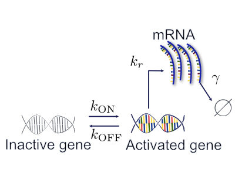

# Telegraphic gene expression
In this example, we will compute the time-varying solutions of the Chemical Master Equation (CME) describing the telegraph gene expression network (see the picture below), starting from an initial condition where the gene is inactive and there are no gene product.




First let's make sure we can import the necessary Julia packages.
```julia
using NumCME
using Catalyst 
using Sundials: CVODE_BDF
using StaticArrays: @MVector
```

## Two ways to input a stochastic reaction network model
`NumCME` supports inputing the stochastic reaction network model using Julia's standard library. If you decide to go this route, you need to first define the stoichiometry matrix, then the propensity functions, the parameter vector, and call [`CmeModel`](@ref) constructor to put these elements together into a single model object.
```julia
# Bursting gene model definition using basic Julia
𝕊 = [[-1, 1, 0] [1, -1, 0] [0, 0, 1] [0, 0, -1]]

a1 = propensity() do x, p
    p[1] * x[1]
end
a2 = propensity() do x, p
    p[2] * x[2]
end
a3 = propensity() do x, p
    p[3] * x[2]
end
a4 = propensity() do x, p
    p[4] * x[3]
end

kon = 0.05
koff = 0.1
kr = 5.0
γ = 0.5
θ = [kon, koff, kr, γ]

model = CmeModel(𝕊, [a1, a2, a3, a4], θ)
```

On the other hand, you can also define a model using Catalyst's [DSL](https://catalyst.sciml.ai/dev/tutorials/dsl/). The following code snippet defines a `Catalyst.ReactionSystem` object that represents the reactions and propensity functions of the telegraph model.
```julia
# Bursting model definition using Catalyst 
@parameters k₀₁ k₁₀ λ γ
bursting_rn = @reaction_network begin 
    kon, Goff --> Gon
    koff, Gon --> Goff 
    kr, Gon --> Gon + mRNA 
    γ, mRNA --> ∅
end k₀₁ k₁₀ λ γ
```

You can then convert it into `NumCME.CmeModel` object like so:
```julia
parameter_values = [koff => 0.05, kon => 0.1, kr => 5.0, γ => 0.5]
model_from_catalyst = CmeModel(bursting_rn, parameter_values)
```

Let's solve the CME using both model objects.
```julia
x₀ = [1, 0, 0]
p0 = FspVectorSparse([@MVector x₀], [1.0]) # Specify initial condition
tspan = (0.0, 300.0)
fspalgorithm = AdaptiveFspSparse(
    ode_method=CVODE_BDF(linear_solver=:GMRES),
    space_adapter=RStepAdapter(5, 10, true)
)
fspsol1 = solve(model, p0, tspan, fspalgorithm)
fspsol2 = solve(model_from_catalyst, p0, tspan, fspalgorithm)
```

Do these two numerical solutions agree?
```julia
# Check that the two ways to code the model lead to the same numerical outputs 
@assert length(fspsol1) == length(fspsol2)
for i ∈ 1:length(fspsol1)
    @assert get_states(fspsol1[i].p) == get_states(fspsol2[i].p)
    @assert get_values(fspsol1[i].p) == get_values(fspsol2[i].p)
end
```
## Which method is faster?
We have verified that the two ways to specify the telegraph model lead to the same numerical output. However, does the use of DSL degrade performance? The answer is a resounding NO. Here are the benchmarking results on an Apple M1 13inch Macbook.

```julia
julia> using BenchmarkTools: @btime
julia> @btime solve(model, p0, tspan, fspalgorithm);
5.454 ms (122573 allocations: 4.50 MiB)
```

```julia
julia> @btime solve(model_from_catalyst, p0, tspan, fspalgorithm);
5.418 ms (122573 allocations: 4.50 MiB)
```

## Remarks
- Specifying three species does _not_ increase the number of states included in the FSP compared to formulating it as a two-species system (with gene ∈ {ON, OFF} and RNA ∈ {0,1,2,...} ). This is because only states that satisfy `G0 + G1 == 1` are reachable from the initial condition and `NumCME`'s state space management, which is based on a reachability analysis of the CME state space, respects this constraint automatically. This is a feature of the "N-step reachability" state space exploration shceme introduced in the very first FSP paper by Munsky and Khammash [^1].
- Thus, the estimate that the number of states increases as $O(n^d)$, while a useful heuristics, can be pessimistic for reaction networks with mass conservation.

## References
[^1]: B. Munsky and M. Khammash, “The finite state projection algorithm for the solution of the chemical master equation,” J. Chem. Phys., vol. 124, no. 4, p. 044104, Jan. 2006, doi: 10.1063/1.2145882.◊


